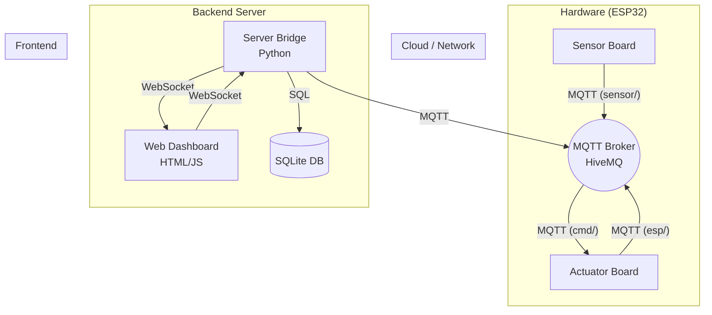

# 🏡 Smart Home: Sistema Domotico IoT per il Controllo di una Stanza

## 1. Introduzione e Obiettivo del Progetto
Questo progetto implementa un sistema di domotica intelligente (Smart Home) basato su architettura IoT (Internet of Things). L'obiettivo è fornire un controllo automatizzato e manuale degli attuatori (luci e sistema di condizionamento/buzzer) all'interno di una stanza, basando le decisioni su sensori ambientali.

Il sistema è suddiviso in moduli distinti che comunicano tramite il protocollo MQTT e un bridge WebSocket per l'interfaccia utente.

## 2. Partecipanti al Progetto
| Ruolo | Nome Progettista | Email Progettista |
| :--- | :--- | :--- |
| Collaboratore 1 | Andruccioli Diego | diego.andruccioli@studio.unibo.it |
| Collaboratore 2 | Mici Rei | rei.mici2@studio.unibo.it |
| Collaboratore 3 | Morelli Giovanni | giovanni.morelli8@studio.unibo.it |

## 3. Componenti e Architettura

### Diagramma del Sistema


### A. Componenti Hardware (Microcontrollori)
| Modulo | Microcontrollore | Sensori/Attuatori |
| :--- | :--- | :--- |
| **Room Sensor Board** | ESP32 | **Sensore PIR** (Movimento), **Sensore DHT22** (Temperatura/Umidità). |
| **Room Actuator Board** | ESP32 | **LED** (Simula Luce), **Buzzer** (Simula Condizionatore/AC). |

### B. Componenti Software e Protocolli
| Modulo | Tecnologia Principale | Protocollo/Libreria | Ruolo |
| :--- | :--- | :--- | :--- |
| **Microcontrollori** | C++/Arduino | MQTT | Comunicazione Device-to-Device e verso il Server. |
| **Server Bridge** | Python / Flask | MQTT / WebSocket | Ponte tra la rete locale (MQTT) e l'interfaccia web (WS), gestione DB. |
| **Dashboard** | HTML / JS / Bootstrap | WebSocket | Interfaccia utente in tempo reale. |
| **Data Visualization** | JavaScript | Plotly.js | Rendering di grafici storici (Temperatura). |

## 4. Funzionalità del Progetto
Il sistema supporta due modalità operative principali per ogni attuatore:

### Controllo Condizionatore (AC / Buzzer)
*   **Modalità Automatica:** Il condizionatore (simulato dal Buzzer) si attiva se la temperatura rilevata dal sensore DHT22 supera la soglia di **24°C**.
*   **Modalità Manuale:** L'utente può forzare l'attivazione o lo spegnimento ("Toggle Buzzer") dalla dashboard.
    *   *Nota:* Se la temperatura è critica (> 24°C), il sistema potrebbe riattivare il condizionatore per sicurezza anche se spento manualmente.

### Controllo Luce (Light / LED)
*   **Modalità Automatica:** La luce si accende automaticamente se viene rilevato movimento (PIR).
*   **Modalità Manuale:** L'utente può forzare l'accensione della luce tramite la dashboard.
    *   *Nota:* La modalità manuale funge da override per mantenere la luce accesa. Se disattivata, la luce segue lo stato del sensore di movimento.

## 5. Stato di Implementazione
Questa tabella riepiloga le funzionalità del sistema rispetto agli obiettivi.

| Nome Funzione | Tipo Modulo | Stato |
| :--- | :--- | :--- |
| Luce: Controllo Manuale | Attuatore / Dashboard | Completato |
| Luce: Logica Automatica (PIR) | Attuatore | Completato |
| AC: Controllo Manuale (Buzzer) | Attuatore / Dashboard | Completato |
| AC: Logica Automatica (Temp > 24°C) | Attuatore | Completato |
| Monitoraggio Movimento (PIR) | Sensori / Dashboard | Completato |
| Monitoraggio Temperatura (DHT22) | Sensori / Dashboard | Completato |
| Persistenza Dati (SQLite) | Server Bridge | Completato |
| Grafici Real-Time | Dashboard (Plotly) | Completato |

## 6. Configurazione
Prima di avviare il progetto, verifica ed eventualmente modifica i parametri di configurazione nei seguenti file:

### Server Bridge (Python)
File: `serverBridge/variable.py`
In questo file puoi impostare:
*   **MQTT_URL / PORT**: Indirizzo del broker HiveMQ.
*   **MQTT_USER / PASS**: Credenziali di accesso al broker.
*   **WEBSOCKET_PORT**: Porta del server WebSocket (default: `8080`).

### Dashboard (Frontend)
File: `roomDashboard/js/socket.js`
*   **WebSocket URL**: Modifica la riga `const webSocket = new WebSocket('ws://localhost:8080');` se il server Python gira su un IP diverso (es. se accedi da smartphone).

### Microcontrollori (Firmware)
File: `*.ino` (in `roomActuatorBoard 2` e `sensor-board (1)`)
*   **ssid / password**: Credenziali della rete WiFi.
*   **mqtt_server / mqtt_user / mqtt_pass**: Credenziali del broker MQTT.
*   *Nota: Se usi Wokwi, queste sono già configurate per la rete Guest virtuale.*

## 7. Installazione e Avvio
Per eseguire il progetto completo, seguire questi passaggi in ordine.

### Prerequisiti
*   Python 3.x installato.
*   Connessione Internet (per il broker MQTT HiveMQ Cloud).

### Step 1: Configurazione Server Bridge e Dashboard
1.  Aprire un terminale nella cartella `serverBridge`.
2.  Installare le dipendenze:
    ```bash
    pip install -r requirements.txt
    ```
3.  Avviare il server backend:
    ```bash
    python app.py
    ```
    *   Il server avvierà sia l'API Flask che il Bridge WebSocket/MQTT.
4.  Aprire il file `roomDashboard/index.html` in un browser web moderno.

### Step 2: Configurazione Microcontrollori
Caricare i firmware sulle rispettive schede ESP32 (o simulatori Wokwi):
1.  **Room Sensor Board**: Caricare `sensor-board (1)/sketch.ino`.
2.  **Room Actuator Board**: Caricare `roomActuatorBoard 2/sketch.ino`.

Una volta verificate le connessioni al WiFi e al Broker MQTT (visibili da Monitor Seriale), il sistema è operativo.

## 8. Licenza
Questo progetto è distribuito sotto licenza **MIT**.
Vedi il file [LICENSE](LICENSE) per maggiori dettagli.
